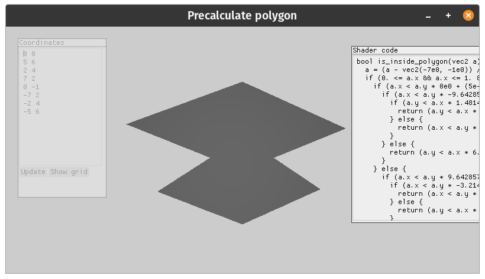

# Code generation for past polygon ray tracing in glsl

This code generates `glsl` code to fast determine is point inside some predetermined polygon or not. Generated code consist of many `if`s that checks in which side point is. At the end of each `if` there is check is point inside some triangle or just false.

Example of generated code:
```glsl
bool is_inside_polygon(vec2 a) {
  a = (a - vec2(-7e0, -1e0)) / vec2(1.4e1, 9e0);
  if (0. <= a.x && a.x <= 1. && 0. <= a.y && a.y <= 1.) {
    if (a.x < a.y * 0e0 + (5e-1)) {
      if (a.x < a.y * -9.642857139910714e-1 + (8.928571424970237e-1)) {
        if (a.y < a.x * 1.4814814733333337e-1 + (3.333333333333333e-1)) {
          return (a.y < a.x * 1.4814814771604934e-1 + (3.3333333314197533e-1)) && !(a.y < a.x * -6.666666665555556e-1 + (3.333333332777778e-1)) && (a.x < a.y * 0e0 + (5e-1));
        } else {
          return (a.x < a.y * -9.642857129598215e-1 + (8.928571419241071e-1)) && (a.y < a.x * 6.222222223155557e-1 + (3.333333333333333e-1)) && !(a.y < a.x * 1.4814814733333337e-1 + (3.333333333333333e-1));
        }
      } else {
        return (a.y < a.x * 6.222222224918519e-1 + (6.888888887540741e-1)) && !(a.x < a.y * -9.642857135785714e-1 + (8.928571421761904e-1)) && (a.x < a.y * 0e0 + (5e-1));
      }
    } else {
      if (a.x < a.y * 9.642857139910719e-1 + (1.0714285733630924e-1)) {
        if (a.x < a.y * -3.214285712142856e-1 + (8.214285712142856e-1)) {
          return (a.x < a.y * -3.2142857083928583e-1 + (8.214285708392859e-1)) && !(a.x < a.y * 0e0 + (5e-1)) && (a.x < a.y * 9.642857139642862e-1 + (1.0714285734523787e-1));
        } else {
          return (a.y < a.x * -6.222222227822222e-1 + (1.3111111113911111e0)) && !(a.x < a.y * -3.2142857083928583e-1 + (8.214285708392859e-1)) && (a.x < a.y * 9.642857140178571e-1 + (1.0714285731547624e-1));
        }
      } else {
        if (a.y < a.x * -1.481481480000001e-1 + (4.814814813333334e-1)) {
          return (a.y < a.x * -1.4814814838271606e-1 + (4.814814815246914e-1)) && !(a.x < a.y * 0e0 + (5e-1)) && !(a.y < a.x * 6.666666665555556e-1 + (-3.333333332777778e-1));
        } else {
          return (a.y < a.x * -6.222222212681483e-1 + (9.555555546014816e-1)) && !(a.x < a.y * 9.642857139642862e-1 + (1.0714285734523787e-1)) && !(a.y < a.x * -1.481481480000001e-1 + (4.814814813333334e-1));
        }
      }
    }
  } else {
    return false;
  }
}
```

For polygon with coordinates:
```
0 8
5 6
2 4
7 2
0 -1
-7 2
-2 4
-5 6
```

Which looks like:



You can use this code as a library, or as a demo. For demo just run `cargo run --release`.